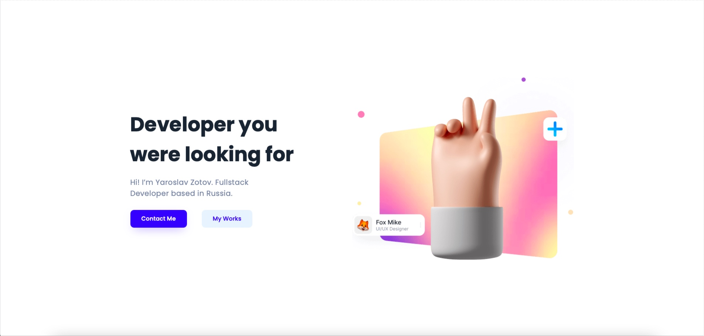

<h1 align="center">
	
	<br/>
	Yaroslav Zotov | Fullstack developer
</h1>


My personal website and portfolio



### Available commands

- ``develop`` run gatsby in dev mode development
- ``build`` build project
- ``test`` run unit tests
- ``format`` format code with prettier
- ``serve`` serve files with gatsby
- ``clean`` clean cache folder

### Start locally

- Clone repository
  ```bash
  git clone https://github.com/zotovY/www
  ```
- Install all dependencies
  ```bash
  npm install
  ```
- Run server with ``npm develop``


### Technologies used
- [Gatsby](https://www.gatsbyjs.com/) & [React](https://reactjs.org/) as main frameworks
- [Typescript](https://www.typescriptlang.org/)  – programming language
- [Styled components](https://github.com/styled-components/styled-components) – styling tool

### Contribution
Do you like this project? Want to contribute and make it cooler?
You can easily do it! First, check
[contribution.md](https://github.com/zotovY/linkup-web/blob/main/contribution.md).
Here you can find instructions that can help to build this project.

### Author
This project was build by [Yaroslav Zotov](https://linkup.zotov.dev/zotovy).

